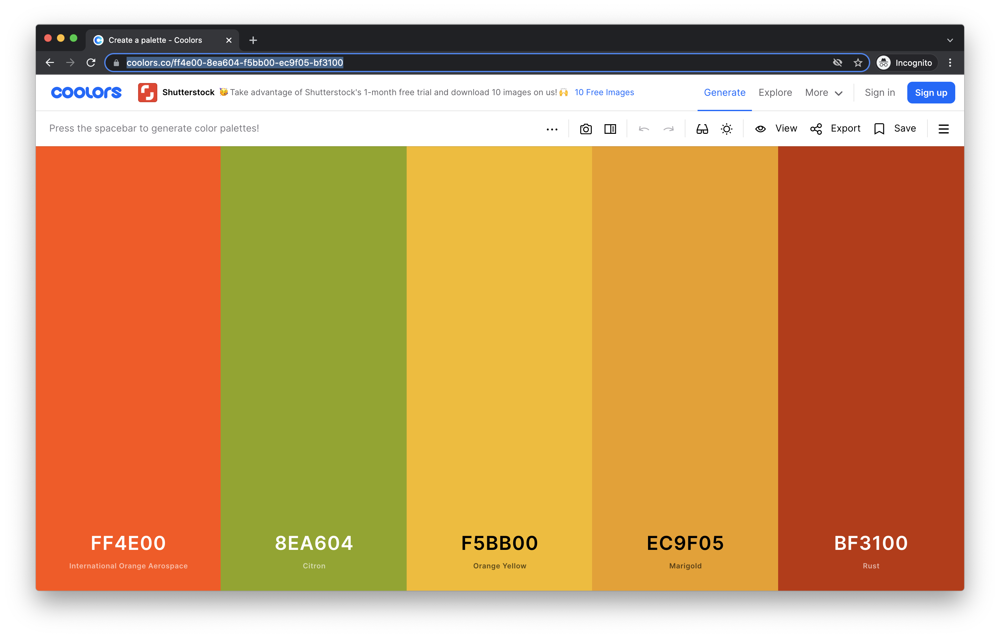
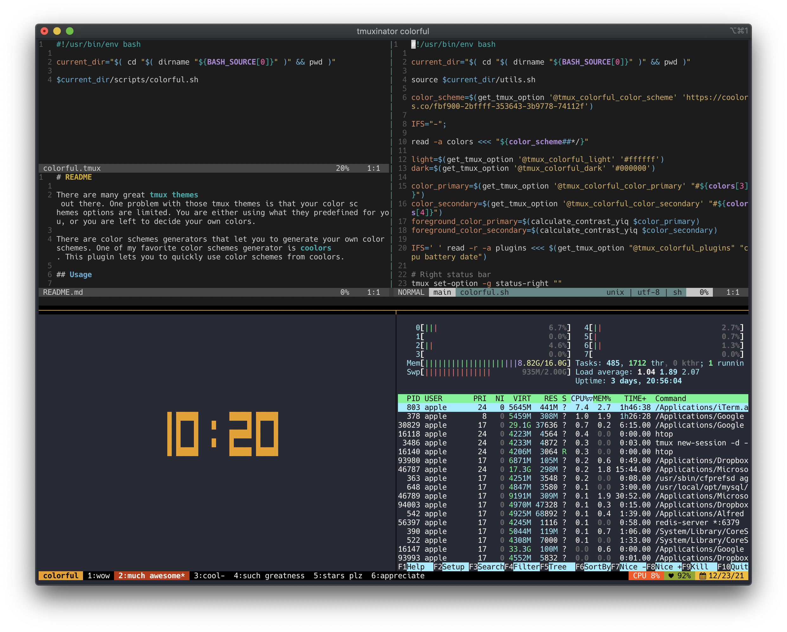

# Tmux-Colorful

> Take control of your [tmux](https://github.com/tmux/tmux) color schemes

There are many great [tmux themes](https://github.com/rothgar/awesome-tmux#themes) out there. One problem with those tmux themes is that your color schemes options are limited. You are either using what they predefined for you, or you are left to decide your own colors.

There are color schemes generators that let you to generate your own color schemes. One of my favorite color schemes generator is [coolors](https://coolors.co/). This plugin lets you to quickly use color schemes from coolors.

## Installation

With [TPM](https://github.com/tmux-plugins/tpm), add this in your tmux config:

```
set -g @plugin 'iggredible/tmux-colorful'
```

Manually, add this in your tmux config:

```
run-shell "/path/to/tmux/colorful.tmux"
```

## Usage

Tmux-Colorful is easy to use. Here's how:

First, head over to https://coolors.co/ and click on Generate. Find the color palette you like. Copy the URL.



Second, assuming that you have Tmux-Colorful installed, paste that URL in your tmux config.

```
set -g @tmux_colorful_color_scheme 'https://coolors.co/ff4e00-8ea604-f5bb00-ec9f05-bf3100'
```

Third, well, there's no third. You're done!



## Copy Paste From Coolors

Tmux-Colorful comes with a predefined default that you can immediately use. However, the real power comes by using *your own* color schemes.

In your tmux config, just add the coolors URL:

```
set -g @tmux_colorful_color_scheme 'https://coolors.co/30362f-625834-a59132-fffbdb-da7422'
```

Then reload tmux with `Prefix + I`.

## Customizations

The color schemes from coolors should be sufficient. However, this plugin also allows a number of customizations.

### Naming Conventions

Before you start customizing Tmux-Colorful, let's go over some naming conventions. Tmux-colorful is divided into 3 general color sections:
- Primary color
- Secondary color
- N colors

SCREENSHOT
The primary color is mainly for the bottom left section. It is also used in different tmux components, ie: active-pane border and clock color.

The secondary color is used in the current window.

The rest of the colors are used for the plugins on the bottom right. By default Tmux-Colorful displays 3 plugins, but you can change them (I'll explain how later). They are numbered and ordered from left to right starting with number 0. The first plugin, CPU display, has color #0, the second plugin, battery display, has color #1, and so on.

### Color Customizations

You can change individual colors. Suppose that you found a nice coolors color scheme but the third plugin color doesn't look quite right, so you want to change one. There are two ways to approach it:

First, you can change the colors from `tmux_colorful_color_scheme`.

```
set -g @tmux_colorful_color_scheme 'https://coolors.co/30362f-625834-a59132-fffbdb-da7422'
```

The first three colors are used for the plugins. The fourth color is the primary color. The fifth color is the secondary color. In this case, since you want to change the third plugin color, you want to change the third color from the coolors URL from `a59143` into your choice color, say `420217`. You now have:

```
set -g @tmux_colorful_color_scheme 'https://coolors.co/30362f-625834-420217-fffbdb-da7422'
```

Alternatively, you can also change them individually based on their color number. Remember, Tmux-Colorful orders the plugin color number starting from 0. The first plugin color is `color_0`, the second is `color_1`, the third is `color_2`. Here you want to change `color_2`:

```
set -g @tmux_colorful_color_2 '#420217'
```

You can also change the session and the current window background colors. Again, you can either change it directly by updating `tmux_colorful_color_scheme` coolors URL (the session is the 4th color and the window background is the 5th color), or you can change them directly with Tmux-Colorful special variables `tmux_colorful_color_primary` for the session color and `tmux_colorful_color_secondary` for the current window color.

```
set -g @tmux_colorful_color_primary '#c84c09'
set -g @tmux_colorful_color_secondary '#d6f599'
```

But what about font color? What if I select a really bright / dark background color? Won't that affect the font color contrast? 

Don't worry, your font color is automatically calculated to keep a decent contrast. If you select a dark background, your font color will be white. If you select a light background, your font color will be black.

### Plugins

This plugin comes with five predefined plugins: 
- `battery`
- `cpu`
- `date`
- `time`
- `network`

By default it is set to display cpu, battery, and date.

To change the plugins to display network, date, cpu, and battery - in that order:

```
set -g @tmux_colorful_plugins "network date cpu battery"
```

You can also change the format of the date and time.

```
set -g @tmux_colorful_date_format '%F'
set -g @tmux_colorful_time_format '%X'
```

At the moment it is limited to five plugins. If you have more plugin ideas, feel free to submit a PR!

### Customizing the Left Status Bar

The left status bar can be customized.

By default, it is displaying the session name. If you want to change it to display status bar followed by the return symbol:

```
set -g @tmux_colorful_left_status_bar '#S ↳'
```

### Customizing the Window Status

To customize the window status format to display the window name followed by a pipe and the window index number:

```
set -g @tmux_colorful_window_status '#W|#I'
```

### Refresh Interval

Tmux-Colorful by default refreshes every second. If you want to change that to 5s:

```
set -g @tmux_colorful_status_interval 5
```

### Tmux clock

Tmux-Colorful uses the primary color for Tmux's clock (Prefix + t). You can change the clock color with:

```
set -g @tmux_colorful_clock_mode_color '#ffffff'
```

You can also change the clock mode between military time (0-23) and regular time (0-11):

```
set -g @tmux_colorful_clock_mode_style 12
```

### Status Background, Foreground, and Alignment

The status background, foreground, and alignment can be customized:

```
set -g @tmux_colorful_status_bg '#ffffff'
set -g @tmux_colorful_status_fg '#000000'
set -g @tmux_colorful_status_justify_format 'centre'
```

*(And yes, tmux spells it "centre").*

### Tmux-Colorful Full Customizations List

Here's a complete list of what you currently can customize:
- Color schemes from coolors: `@tmux_colorful_color_scheme 'https://coolors.co/30362f-625834-a59132-fffbdb-da7422'`
- Primary color (left status bar and other parts): `@tmux_colorful_color_primary '#c84c09'`
- Secondary color (window status): `@tmux_colorful_color_secondary '#d6f599'`
- N colors (plugin colors): `@tmux_colorful_color_0 '#ffffff'`, `@tmux_colorful_color_1 '#ffffff'`, `@tmux_colorful_color_2 '#ffffff'`, etc.
- Plugin lists: `@tmux_colorful_plugins 'cpu battery date'`
- Left status bar: `@tmux_colorful_left_status_bar '#S'`
- Window status: `@tmux_colorful_window_status '#I:#W#F'`
- Status refresh interval: `@tmux_colorful_status_interval 10`
- Clock color: `@tmux_colorful_clock_mode_color '#ffffff'`
- Clock military/non-military style: `@tmux_colorful_clock_mode_style 24`
- Status background: `@tmux_colorful_status_bg '#ffffff'`
- Status foreground: `@tmux_colorful_status_fg '#000000'`
- Status alignment: `@tmux_colorful_status_justify_format 'left'`

## Help, I Am Still Seeing Some Old Changes!

If you made a color change, but that color is still there even after you ran `Prefix + I`, detach tmux (`Prefix + d`) then kill the server (`tmux kill-server`).

## Other Color Schemes Generator

Although Tmux-Colorful is optimized for coolors, you are not limited to only using coolors. Here are some of color schemes generatrs out there:
- [Adobe Color](https://color.adobe.com/)
- [Paletton](https://paletton.com/)
- [ColorSpace](https://mycolor.space/)
- [Canva Color Palette](https://www.canva.com/colors/color-palettes/)
- [...and many, many more!](https://www.google.com/search?q=color+scheme+generator)

## Contributing

Ideas, suggestions, and bug fixes are welcome. Feel free to submit a PR! Your help is highly coveted.

# License

MIT (c) Igor Irianto
